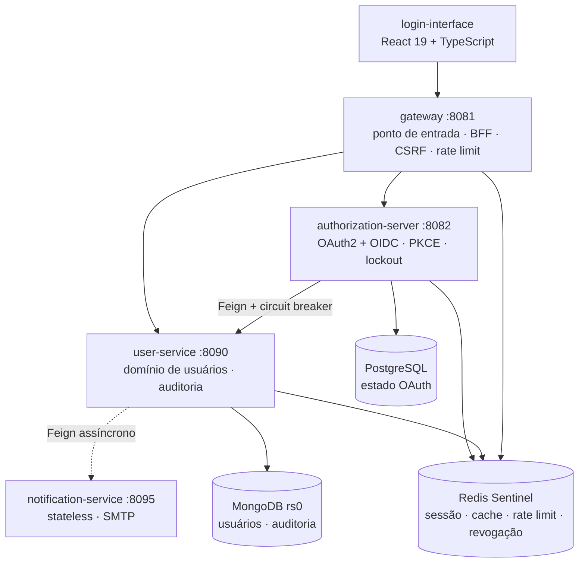
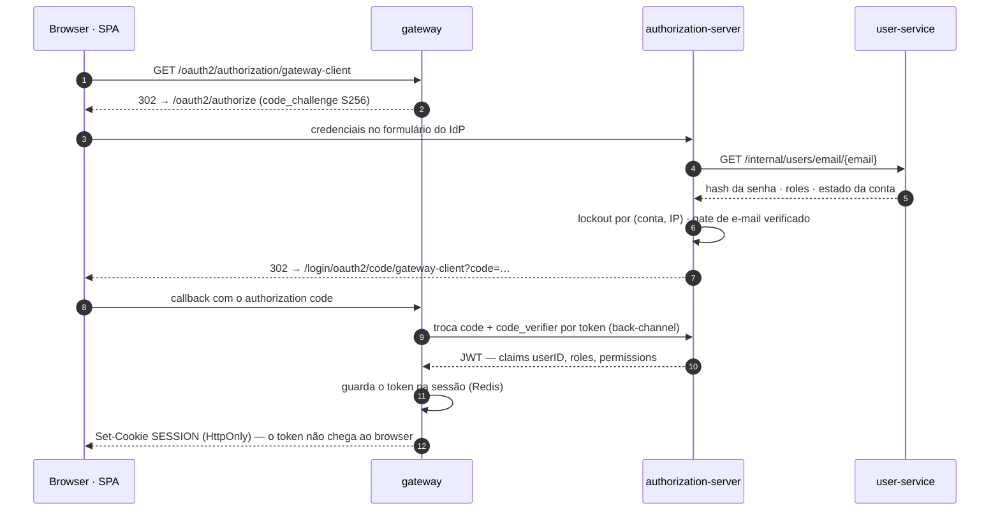

# Informações gerais do projeto

**Sistema de identidade e gerenciamento de usuários em microsserviços** — com um Authorization
Server OAuth2/OIDC implementado no projeto.

Autenticação, registro, perfil e controle de acesso funcionam ponta a ponta: `authorization_code`
com PKCE obrigatório, refresh token, verificação de e-mail, lockout anti-brute-force, revogação
ativa de token e trilha de auditoria LGPD. O front-end React usa o padrão **BFF** — o token nunca
alcança o browser.

**Stack:** Java 21 · Spring Boot 4 · Spring Cloud 2025 · MongoDB · PostgreSQL · Redis Sentinel ·
OAuth2 + PKCE · React 19 + TypeScript · Docker Compose

---

## O que este projeto demonstra

- **Um Authorization Server OAuth2/OIDC de verdade** — `authorization_code` + PKCE obrigatório +
  refresh token, chave JWK persistente com `kid` estável, estado OAuth em PostgreSQL para
  suportar múltiplas instâncias. Não é `spring-boot-starter-security` com um filtro de JWT.
- **Padrão BFF levado a sério** — o gateway é o cliente OAuth2; o SPA usa sessão por cookie
  `HttpOnly` e **zero `localStorage`**. O token de acesso não existe no browser em momento algum.
- **Resiliência que distingue tipos de falha** — o fallback do circuit breaker separa "usuário não
  existe" (negócio) de "o serviço caiu" (infraestrutura), para que uma indisponibilidade não seja
  contada como credencial errada e não tranque contas por lockout.
- **Segurança tratada como invariante, não como feature** — revogação ativa de token por epoch,
  leitura de PII de terceiro restrita a ADMIN, canal interno isolado do gateway, CSRF por token
  sincronizador, rate limiting em três tiers e base Docker que não publica porta alguma.
- **Decisões registradas** — 26 ADRs documentando o _porquê_ de cada escolha, e um inventário
  aberto dos gaps de segurança **ainda não fechados**, com mitigação e caminho de saída.

## Números

|                    |                                                                             |
| :----------------- | :-------------------------------------------------------------------------- |
| Módulos            | 6 serviços Spring + SPA React                                               |
| Código de produção | ~6.100 linhas                                                               |
| Testes             | 602 (558 backend · 44 front-end)                                            |
| Cobertura de linha | 96,9% user-service · 96,0% auth-server · 99,3% gateway · 87,8% notification |
| Gate de cobertura  | 70% LINE/BUNDLE na fase `verify`, falha o build                             |
| ADRs               | 26                                                                          |
| Containers         | 19 no piso mínimo · 26 com `--profile ha`                                   |

---

https://github.com/user-attachments/assets/4fc78b99-18c2-49ad-ac7c-8c2349b6665c

---

## Arquitetura



O `authorization-server` **nunca acessa o MongoDB** — consulta credenciais pelo canal interno do
`user-service`. Cada serviço de domínio é um resource server independente: valida o JWT pelo JWKS
por conta própria, sem confiar no gateway.

Completam a stack o `config-server` atrás de um LB nginx, o Eureka para service discovery e
Zipkin · Prometheus · Grafana para observabilidade. O `up` sem argumento sobe o **piso mínimo**
(replica set de um membro, um Redis, um Sentinel) — degenerado, não standalone, o que mantém a
configuração do cliente idêntica do piso ao topo. Crescer é `--profile ha` e `--scale`
([ADR-024](adr/ADR-024-elasticidade-piso-minimo-eixos-escala.md)).

## Fluxo de login



---

## Decisões que valem a pena ver

O valor deste projeto está menos no que ele faz e mais no _porquê_ de cada escolha. Quatro
entradas para quem tem cinco minutos:

| Decisão                                                                                                           | O problema que ela resolve                                                                                                                                                                                                                                                                       |
| ----------------------------------------------------------------------------------------------------------------- | ------------------------------------------------------------------------------------------------------------------------------------------------------------------------------------------------------------------------------------------------------------------------------------------------ |
| [ADR-021](adr/ADR-021-remocao-listagem-publica-usuarios.md)                                                  | O fallback do circuit breaker tratava qualquer `FeignException` como "usuário não encontrado". Uma queda do `user-service` passava a contar como credencial errada e trancava contas por lockout. A correção distingue 404 de indisponibilidade — e o mesmo ADR fecha um IDOR de leitura de PII. |
| [ADR-020](adr/ADR-020-swagger-atras-da-sessao.md)                                                            | O Swagger-UI era público e o bloco `initOAuth` publicava o `client_secret` do gateway na página. A documentação passou para trás da sessão do BFF.                                                                                                                                               |
| [ADR-025](adr/ADR-025-revalidacao-estado-emissao.md)                                                         | Entre autenticar e emitir o token, o estado do titular pode mudar. A re-derivação na emissão fecha a janela — com meia dúzia de detalhes que parecem cosméticos e não são.                                                                                                                       |
| [ADR-017](adr/ADR-017-revogacao-ativa-token.md) · [ADR-026](adr/ADR-026-revogacao-troca-senha-email.md) | JWT é, por natureza, válido até expirar. Um epoch de revogação por usuário no Redis permite invalidar tokens em mudança de role, desativação, hard-delete e troca de senha ou e-mail.                                                                                                            |

E uma decisão de arquitetura que costuma gerar boa conversa: **não existe módulo `common`** neste
projeto. A duplicação de `ClientIpResolver`, `LogUtils` e `InternalTokenFilter` entre serviços é
deliberada — o racional está em [docs/CONVENCOES.md](CONVENCOES.md).

## Estado atual e próximos passos

O sistema funciona ponta a ponta e é publicável na internet por um Cloudflare Tunnel com domínio
fixo, em topologia de hostname único — hoje hospedado na própria máquina de desenvolvimento, não
em nuvem. O que **não** está pronto está documentado em vez de escondido:
[docs/SECURITY.md](SECURITY.md) mantém o inventário dos gaps conhecidos — com mitigação atual
e caminho de saída para cada um. O mais relevante hoje é o SMTP em placeholder, que impede abrir
cadastro externo.

A evolução natural do projeto é virar um **provedor de identidade multi-tenant**, servindo
front-ends e APIs de terceiros. As fases estão dimensionadas:

| Fase                     | Escopo                                                                         |
| ------------------------ | ------------------------------------------------------------------------------ |
| Fundação                 | recuperação de senha, SMTP real, MFA                                           |
| Modelagem do tenant      | o que é tenant, `iss` por tenant vs. `aud`, estratégia de isolamento           |
| Isolamento de dados      | unicidade de e-mail por tenant, filtro obrigatório, chaves Redis particionadas |
| Autorização multi-tenant | papéis por cliente, validação de `aud`/`iss` em todo resource server           |
| Plano de controle        | registro de clientes, consent, portal self-service                             |
| Operação em nuvem        | IaC, bancos gerenciados, rotação de JWK, backup testado                        |

## Documentação

| Documento                                          | Conteúdo                                                 |
| -------------------------------------------------- | -------------------------------------------------------- |
| [docs/RECEITA.md](RECEITA.md)                 | passo a passo para rodar: local e deploy via túnel       |
| [docs/ARQUITETURA.md](ARQUITETURA.md)         | camadas de cada serviço, fluxos ponta a ponta, contratos |
| [docs/SERVICOS.md](SERVICOS.md)               | referência da API: endpoints, schema MongoDB, cache      |
| [docs/SECURITY.md](SECURITY.md)               | controles ativos e gaps conhecidos                       |
| [docs/TESTES.md](TESTES.md)                   | estratégia de testes, cobertura, smoke-test              |
| [docs/CONVENCOES.md](CONVENCOES.md)           | convenções e invariantes de design                       |
| [docs/OBSERVABILIDADE.md](OBSERVABILIDADE.md) | tracing, métricas, dashboards                            |
| [docs/adr/](adr/)                             | os 26 Architecture Decision Records                      |

---

# Rodar o projeto

> **Para executar o projeto** — pré-requisitos, ambiente local, deploy via Cloudflare Tunnel e
> URLs de acesso — siga a [RECEITA.md](RECEITA.md), passo a passo.
>
> Daqui em diante este documento cobre a estrutura de pastas, a integração contínua e os testes.

## Estrutura de pastas e arquivos

```
.
├── authorization-server/         # OAuth2 Authorization Server (login, emissão de JWT)
├── config-server/                # Config centralizada (YAMLs dos serviços em resources/config)
├── discovery-server/             # Service discovery (Eureka)
├── gateway/                      # Spring Cloud Gateway — borda, BFF, rate limiting, CSRF
├── user-service/                 # Domínio de usuários (CRUD, MongoDB, cache Redis)
├── notification-service/         # Envio de e-mail de verificação (stateless, SMTP)
├── login-interface/              # SPA React (Vite + TailwindCSS)
├── infra/                        # Configs de infraestrutura:
│   ├── secrets/                  #   gen-secrets.sh (gera os Docker secrets)
│   ├── jwk/                      #   gen-keys.sh (par de chaves JWT)
│   ├── docker/                   #   Dockerfile.jvm único dos 6 módulos Spring
│   ├── config-lb/                #   nginx LB dos config-servers
│   ├── mongo/                    #   keyfile + rs-reconcile.sh do replica set
│   ├── redis/                    #   sentinel.conf
│   ├── grafana/                  #   dashboards e datasources provisionados
│   ├── cloudflared/              #   ingress rules do named tunnel (versionadas)
│   ├── smoke-test/               #   smoke-test da topologia de login (CI)
│   ├── prometheus.yml            #   alvos de scrape
│   └── traffic.sh                #   gerador de tráfego pela origem pública
├── docs/                         # Documentação técnica detalhada
├── docker-compose.yml            # Base prod-safe (não publica NENHUMA porta no host)
├── docker-compose.override.yml   # Deltas de dev (republica portas internas; auto-carregado)
├── docker-compose.deploy.yml     # Overlay opcional — Cloudflare Tunnel
└── .env.example                  # Template do .env (contrato de variáveis, comentado)
```

> Árvore completa e anotada (pacotes, classes por camada, testes, `infra/`), junto da
> arquitetura interna de cada serviço, em [docs/ARQUITETURA.md](ARQUITETURA.md).

---

## Integração Contínua (CI)

A cada `push` na `main` e a cada `pull_request`, o workflow [`ci.yml`](../.github/workflows/ci.yml)
roda no GitHub Actions quatro frentes em paralelo:

| Job                | O que roda                                                                                                                                                                                                      |
| ------------------ | --------------------------------------------------------------------------------------------------------------------------------------------------------------------------------------------------------------- |
| `backend` (matrix) | `mvn -B -pl <módulo> -am verify` por módulo (6 serviços) — dispara o gate de cobertura JaCoCo; integração via Testcontainers no Docker do runner                                                                |
| `frontend`         | `npm ci` + `npm run coverage` no `login-interface` — Vitest com threshold de 80%                                                                                                                                |
| `compose-validate` | `docker compose config -q` no piso mínimo, no `--profile ha` e em base + override; confere que o delta piso→`ha` são exatamente os 7 nós de redundância e que o eixo replicável não tem `container_name` nem `ports:` na base |
| `smoke-test-login` | sobe `interface` + `gateway` e suas dependências no piso mínimo (topologia de deploy, sem `cloudflared`) e valida 6 asserções HTTP da cadeia de login — [ADR-023](adr/ADR-023-smoke-test-automatizado-login-hostname-unico.md) |

O `smoke-test-login` é o único job que exercita o container `interface`: os Testcontainers nunca
sobem o nginx e o `compose-validate` valida topologia, não comportamento. É também o mais lento — builda 4
imagens do zero. Detalhes e execução local em [docs/TESTES.md](TESTES.md#smoke-test-da-topologia-de-login-adr-023).

Há POM-pai agregador na raiz, então `mvn verify` ali constrói os seis — mas o back-end **continua
rodando como matrix**, um job por módulo, de propósito: um job único serializaria os seis builds
com Testcontainers, e o wall-clock passaria do módulo mais lento para a soma de todos.
Os relatórios (Surefire, JaCoCo, cobertura do Vitest) são publicados como artefatos do run.

> **Não renomeie o job `backend` nem os valores da matriz.** Os contextos de branch protection
> abaixo referenciam `backend (<módulo>)` literalmente — renomear derruba o gate de merge sem
> nenhum erro visível.

**Gate de merge (branch protection):** a `main` exige todos os checks acima verdes antes de
aceitar merge. Para (re)aplicar a regra via API (precisa de admin no repo):

```bash
gh api -X PUT repos/k-lila/user-service/branches/main/protection \
  -H "Accept: application/vnd.github+json" \
  -f 'required_status_checks[strict]=true' \
  -f 'required_status_checks[contexts][]=backend (config-server)' \
  -f 'required_status_checks[contexts][]=backend (discovery-server)' \
  -f 'required_status_checks[contexts][]=backend (authorization-server)' \
  -f 'required_status_checks[contexts][]=backend (user-service)' \
  -f 'required_status_checks[contexts][]=backend (gateway)' \
  -f 'required_status_checks[contexts][]=backend (notification-service)' \
  -f 'required_status_checks[contexts][]=frontend' \
  -f 'required_status_checks[contexts][]=compose-validate' \
  -f 'required_status_checks[contexts][]=smoke-test-login' \
  -F 'enforce_admins=false' \
  -F 'required_pull_request_reviews=null' \
  -F 'restrictions=null'
```

> Os nomes dos checks só existem no GitHub após o workflow rodar ao menos uma vez — aplique
> a regra depois da primeira run verde.

---

## Testes

Requerem Java 21 + Maven 3.9+ no host:

```bash
# tudo — os seis módulos, a partir da raiz
mvn test

# user-service — unitários + controllers + integração
# (integração usa Testcontainers: requer Docker rodando)
mvn -pl user-service -am test

# authorization-server — unitários + integração (Testcontainers: Postgres, Redis + WireMock)
mvn -pl authorization-server -am test
```
