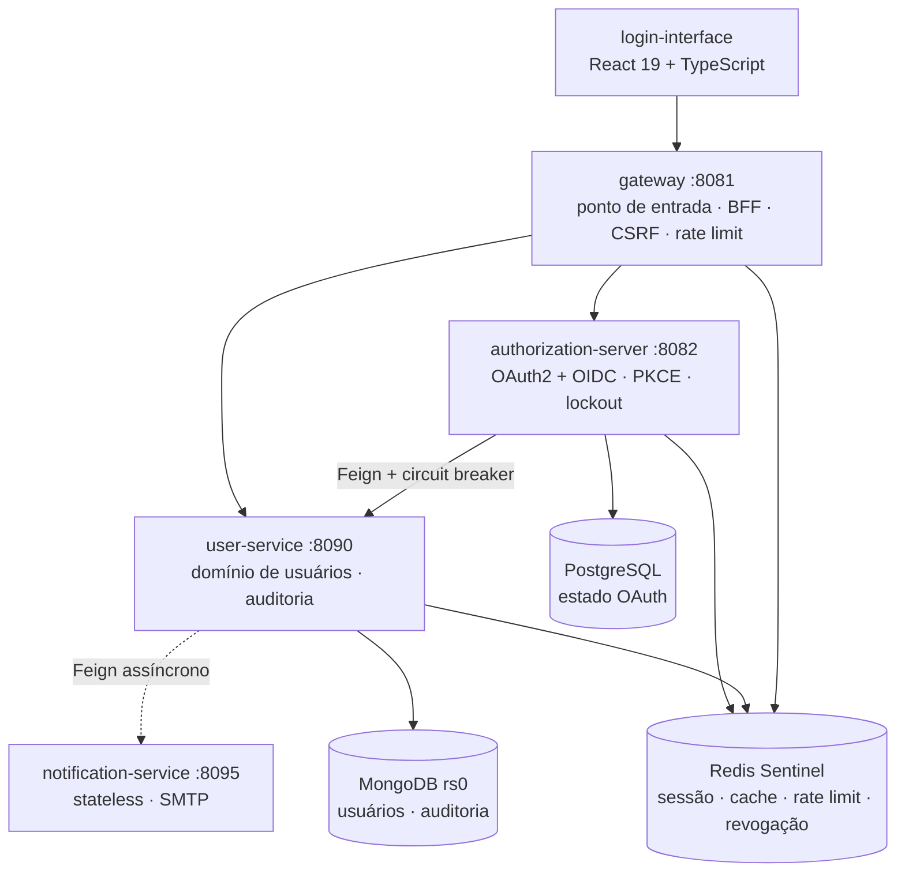
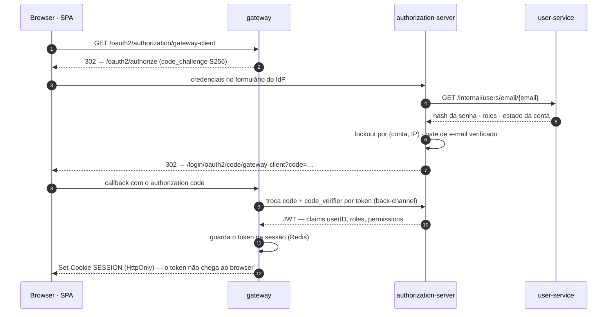

# Informações gerais do projeto

**Sistema de identidade e gerenciamento de usuários em microsserviços** — com um Authorization
Server OAuth2/OIDC implementado no projeto.

Autenticação, registro, perfil e controle de acesso funcionam ponta a ponta: `authorization_code`
com PKCE obrigatório, refresh token, verificação de e-mail, lockout anti-brute-force, revogação
ativa de token e trilha de auditoria LGPD. O front-end React usa o padrão **BFF** — o token nunca
alcança o browser.

**Stack:** Java 21 · Spring Boot 4 · Spring Cloud 2025 · MongoDB · PostgreSQL · Redis Sentinel ·
OAuth2 + PKCE · React 19 + TypeScript · Docker Compose

---

## O que este projeto demonstra

- **Um Authorization Server OAuth2/OIDC de verdade** — `authorization_code` + PKCE obrigatório +
  refresh token, chave JWK persistente com `kid` estável, estado OAuth em PostgreSQL para
  suportar múltiplas instâncias. Não é `spring-boot-starter-security` com um filtro de JWT.
- **Padrão BFF levado a sério** — o gateway é o cliente OAuth2; o SPA usa sessão por cookie
  `HttpOnly` e **zero `localStorage`**. O token de acesso não existe no browser em momento algum.
- **Resiliência que distingue tipos de falha** — o fallback do circuit breaker separa "usuário não
  existe" (negócio) de "o serviço caiu" (infraestrutura), para que uma indisponibilidade não seja
  contada como credencial errada e não tranque contas por lockout.
- **Segurança tratada como invariante, não como feature** — revogação ativa de token por epoch,
  leitura de PII de terceiro restrita a ADMIN, canal interno isolado do gateway, CSRF por token
  sincronizador, rate limiting em três tiers e base Docker que não publica porta alguma.
- **Decisões registradas** — 26 ADRs documentando o _porquê_ de cada escolha, e um inventário
  aberto dos gaps de segurança **ainda não fechados**, com mitigação e caminho de saída.

## Números

|                    |                                                                             |
| :----------------- | :-------------------------------------------------------------------------- |
| Módulos            | 6 serviços Spring + SPA React                                               |
| Código de produção | ~6.100 linhas                                                               |
| Testes             | 602 (558 backend · 44 front-end)                                            |
| Cobertura de linha | 96,9% user-service · 96,0% auth-server · 99,3% gateway · 87,8% notification |
| Gate de cobertura  | 70% LINE/BUNDLE na fase `verify`, falha o build                             |
| ADRs               | 26                                                                          |
| Containers         | 19 no piso mínimo · 26 com `--profile ha`                                   |

---

https://github.com/user-attachments/assets/4fc78b99-18c2-49ad-ac7c-8c2349b6665c

---

## Arquitetura



O `authorization-server` **nunca acessa o MongoDB** — consulta credenciais pelo canal interno do
`user-service`. Cada serviço de domínio é um resource server independente: valida o JWT pelo JWKS
por conta própria, sem confiar no gateway.

Completam a stack o `config-server` atrás de um LB nginx, o Eureka para service discovery e
Zipkin · Prometheus · Grafana para observabilidade. O `up` sem argumento sobe o **piso mínimo**
(replica set de um membro, um Redis, um Sentinel) — degenerado, não standalone, o que mantém a
configuração do cliente idêntica do piso ao topo. Crescer é `--profile ha` e `--scale`
([ADR-024](adr/ADR-024-elasticidade-piso-minimo-eixos-escala.md)).

## Fluxo de login



---

## Decisões que valem a pena ver

O valor deste projeto está menos no que ele faz e mais no _porquê_ de cada escolha. Quatro
entradas para quem tem cinco minutos:

| Decisão                                                                                                           | O problema que ela resolve                                                                                                                                                                                                                                                                       |
| ----------------------------------------------------------------------------------------------------------------- | ------------------------------------------------------------------------------------------------------------------------------------------------------------------------------------------------------------------------------------------------------------------------------------------------ |
| [ADR-021](adr/ADR-021-remocao-listagem-publica-usuarios.md)                                                  | O fallback do circuit breaker tratava qualquer `FeignException` como "usuário não encontrado". Uma queda do `user-service` passava a contar como credencial errada e trancava contas por lockout. A correção distingue 404 de indisponibilidade — e o mesmo ADR fecha um IDOR de leitura de PII. |
| [ADR-020](adr/ADR-020-swagger-atras-da-sessao.md)                                                            | O Swagger-UI era público e o bloco `initOAuth` publicava o `client_secret` do gateway na página. A documentação passou para trás da sessão do BFF.                                                                                                                                               |
| [ADR-025](adr/ADR-025-revalidacao-estado-emissao.md)                                                         | Entre autenticar e emitir o token, o estado do titular pode mudar. A re-derivação na emissão fecha a janela — com meia dúzia de detalhes que parecem cosméticos e não são.                                                                                                                       |
| [ADR-017](adr/ADR-017-revogacao-ativa-token.md) · [ADR-026](adr/ADR-026-revogacao-troca-senha-email.md) | JWT é, por natureza, válido até expirar. Um epoch de revogação por usuário no Redis permite invalidar tokens em mudança de role, desativação, hard-delete e troca de senha ou e-mail.                                                                                                            |

E uma decisão de arquitetura que costuma gerar boa conversa: **não existe módulo `common`** neste
projeto. A duplicação de `ClientIpResolver`, `LogUtils` e `InternalTokenFilter` entre serviços é
deliberada — o racional está em [docs/CONVENCOES.md](CONVENCOES.md).

## Estado atual e próximos passos

O sistema funciona ponta a ponta e é publicável na internet por um Cloudflare Tunnel com domínio
fixo, em topologia de hostname único — hoje hospedado na própria máquina de desenvolvimento, não
em nuvem. O que **não** está pronto está documentado em vez de escondido:
[docs/SECURITY.md](SECURITY.md) mantém o inventário dos gaps conhecidos — com mitigação atual
e caminho de saída para cada um. O mais relevante hoje é o SMTP em placeholder, que impede abrir
cadastro externo.

A evolução natural do projeto é virar um **provedor de identidade multi-tenant**, servindo
front-ends e APIs de terceiros. As fases estão dimensionadas:

| Fase                     | Escopo                                                                         |
| ------------------------ | ------------------------------------------------------------------------------ |
| Fundação                 | recuperação de senha, SMTP real, MFA                                           |
| Modelagem do tenant      | o que é tenant, `iss` por tenant vs. `aud`, estratégia de isolamento           |
| Isolamento de dados      | unicidade de e-mail por tenant, filtro obrigatório, chaves Redis particionadas |
| Autorização multi-tenant | papéis por cliente, validação de `aud`/`iss` em todo resource server           |
| Plano de controle        | registro de clientes, consent, portal self-service                             |
| Operação em nuvem        | IaC, bancos gerenciados, rotação de JWK, backup testado                        |

## Documentação

| Documento                                          | Conteúdo                                                 |
| -------------------------------------------------- | -------------------------------------------------------- |
| [docs/ARQUITETURA.md](ARQUITETURA.md)         | camadas de cada serviço, fluxos ponta a ponta, contratos |
| [docs/SERVICOS.md](SERVICOS.md)               | referência da API: endpoints, schema MongoDB, cache      |
| [docs/SECURITY.md](SECURITY.md)               | controles ativos e gaps conhecidos                       |
| [docs/TESTES.md](TESTES.md)                   | estratégia de testes, cobertura, smoke-test              |
| [docs/CONVENCOES.md](CONVENCOES.md)           | convenções e invariantes de design                       |
| [docs/OBSERVABILIDADE.md](OBSERVABILIDADE.md) | tracing, métricas, dashboards                            |
| [docs/adr/](adr/)                             | os 26 Architecture Decision Records                      |

---

# Rodar o projeto

> Daqui em diante este documento é **operacional**: estrutura de pastas, pré-requisitos, execução local,
> deploy, integração contínua e testes.

## Estrutura de pastas e arquivos

```
.
├── authorization-server/         # OAuth2 Authorization Server (login, emissão de JWT)
├── config-server/                # Config centralizada (YAMLs dos serviços em resources/config)
├── discovery-server/             # Service discovery (Eureka)
├── gateway/                      # Spring Cloud Gateway — borda, BFF, rate limiting, CSRF
├── user-service/                 # Domínio de usuários (CRUD, MongoDB, cache Redis)
├── notification-service/         # Envio de e-mail de verificação (stateless, SMTP)
├── login-interface/              # SPA React (Vite + TailwindCSS)
├── infra/                        # Configs de infraestrutura:
│   ├── secrets/                  #   gen-secrets.sh (gera os Docker secrets)
│   ├── jwk/                      #   gen-keys.sh (par de chaves JWT)
│   ├── docker/                   #   Dockerfile.jvm único dos 6 módulos Spring
│   ├── config-lb/                #   nginx LB dos config-servers
│   ├── mongo/                    #   keyfile + rs-reconcile.sh do replica set
│   ├── redis/                    #   sentinel.conf
│   ├── grafana/                  #   dashboards e datasources provisionados
│   ├── cloudflared/              #   ingress rules do named tunnel (versionadas)
│   ├── smoke-test/               #   smoke-test da topologia de login (CI)
│   ├── prometheus.yml            #   alvos de scrape
│   └── traffic.sh                #   gerador de tráfego pela origem pública
├── docs/                         # Documentação técnica detalhada
├── docker-compose.yml            # Base prod-safe (não publica NENHUMA porta no host)
├── docker-compose.override.yml   # Deltas de dev (republica portas internas; auto-carregado)
├── docker-compose.deploy.yml     # Overlay opcional — Cloudflare Tunnel
└── .env.example                  # Template do .env (contrato de variáveis, comentado)
```

> Árvore completa e anotada (pacotes, classes por camada, testes, `infra/`), junto da
> arquitetura interna de cada serviço, em [docs/ARQUITETURA.md](ARQUITETURA.md).

---

## Pré-requisitos

| Ferramenta              | Versão mínima | Necessário para            |
| ----------------------- | ------------- | -------------------------- |
| Docker + Docker Compose | 24+           | Execução (única suportada) |

---

## Execução

### 0. Gerar os secrets e a chave JWK (obrigatório, uma vez)

```bash
infra/secrets/gen-secrets.sh        # defaults de DEV (rode uma vez antes do up)
```

> Em dev **manual** (sem Docker), gere só o par JWK no classpath do auth-server:
> `infra/jwk/gen-keys.sh authorization-server/src/main/resources/keys`.

### 1. Criar o `.env` (obrigatório)

O `.env` guarda apenas as **identidades não-segredo** (usuários, hostnames públicos) interpoladas no compose — os segredos vêm do passo 0.

> **Atenção:** a base **não** tem fail-fast. As interpolações do `docker-compose.yml`
> (`${MONGO_USER}`, `${POSTGRES_USER}`, `${CONFIG_SERVER_USERNAME}`, `${GRAFANA_ADMIN_USER}`) são
> `${VAR}` simples — sem `.env`, o Compose as substitui por **string vazia com um warning** e a
> stack sobe até o Mongo/Postgres recusarem a credencial vazia. O `docker compose config -q` do CI
> passa assim. O fail-fast de verdade (`${VAR:?}`) existe só no overlay de deploy
> (`PUBLIC_ORIGIN`, `PUBLIC_HOST`, `TUNNEL_ID`). Ou seja: preencher o `.env` é obrigatório, mas
> quem avisa é o banco, não o Compose.

```bash
cp .env.example .env   # e preencha os valores (em dev, qualquer valor consistente serve)
```

### 2a. Desenvolvimento local (HTTP, modo padrão)

```bash
docker compose up -d --build      # base + docker-compose.override.yml (auto-carregado)

docker compose logs -f            # acompanhar logs
docker compose down -v            # derrubar (incluindo volumes)
```

Acesso: front-end em http://localhost:5173 · API em http://localhost:8081.

Para a topologia **prod-safe** (sem as portas de dev):

```bash
docker compose -f docker-compose.yml up -d --build   # ignora o override
# URLs públicas via .env — ver o bloco comentado no .env.example
```

> **Este comando sobe uma stack sem porta nenhuma no host.** Desde o G10 ([ADR-019](adr/ADR-019-correcao-elos-login-hostname-unico.md))
> a base não publica `gateway` nem `interface` — é exatamente o ponto dela. Serve para validar a
> topologia (é o que o `compose-validate` do CI faz) e como base do overlay de deploy, que abre a
> borda pelo túnel. Se você quer alcançar o sistema pelo browser, use `2a` (dev) ou `2b` (deploy);
> aqui não há o que abrir sem publicar porta por conta própria.

### 2a-bis. Piso mínimo e crescimento (ADR-024)

O comando acima sobe o **piso mínimo**: 19 serviços, com Mongo em replica set `rs0` de **um
membro** e Redis com **um** nó e **um** Sentinel. É o default porque um blueprint precisa subir
numa máquina modesta. Crescer é aditivo, e nunca reconfigura cliente:

```bash
docker compose up -d                            # piso mínimo (19 serviços, ~3,5 GB de reserva)

docker compose --profile ha up -d               # + redundância de dados (26 serviços)
                                                #   mongo 1→3 membros, redis 1→3, sentinels 1→3,
                                                #   discovery 1→2. O replica set cresce sozinho.

docker compose -f docker-compose.yml up -d \
  --scale gateway=2 --scale user-service=2      # + réplicas de aplicação
```

Três coisas que economizam uma tarde:

- **`--scale` exige o `-f docker-compose.yml` explícito.** Sem ele o Compose carrega o
  `docker-compose.override.yml`, que publica portas fixas no host, e a 2ª réplica falha no bind.
  Listas de `ports:` são concatenadas no merge entre arquivos — nenhum overlay consegue removê-las.
- **O piso mínimo não é HA.** Um nó Mongo e um Redis, sem failover. É elasticidade (subir pequeno,
  crescer depois), não redundância — ver [docs/SECURITY.md](SECURITY.md).
- **Encolher o Mongo é manual.** Crescer é automático (`rs.reconfig` aditivo por descoberta DNS);
  voltar de 3 para 1 membro exige `rs.remove` antes de desligar o profile, senão o replica set
  fica com dois membros ausentes e sem quorum para eleger primário.
- **`down` também precisa do profile.** `docker compose down -v` sem `--profile ha` **não remove**
  os containers e volumes dos nós de redundância — eles ficam órfãos, e o `up` seguinte reencontra
  volumes antigos. Para teardown completo: `docker compose --profile ha down -v --remove-orphans`.

### 2b. Deploy na própria máquina via Cloudflare Tunnel (domínio fixo)

**Named tunnel + domínio próprio.** O túnel entrega em `interface:80` (o nginx do SPA), que faz
proxy same-origin ao gateway — browser e API na **mesma origem**, e nem o gateway nem o
authorization-server ficam alcançáveis de fora. `${PUBLIC_ORIGIN}` designa a origem pública
(ex.: `https://app.exemplo.com`) e `${PUBLIC_HOST}` o hostname sem esquema; os valores reais vivem
só no `.env` (gitignorado).

#### Pré-requisitos na Cloudflare (uma vez, fora do repositório)

O túnel é **locally-managed**: criado pela CLI, não pelo painel. O Zero Trust — onde ficariam o
token e os _public hostnames_ — exige cadastro de cartão de crédito mesmo no plano free, então o
roteamento da borda vive em [`infra/cloudflared/config.yml`](../infra/cloudflared/config.yml),
versionado.

**1. Delegar o domínio à Cloudflare** (pode levar horas — comece por aqui). No painel do
registrador, troque os servidores DNS pelos dois nameservers que a Cloudflare atribuiu e **não
publique registros DS** (DNSSEC desligado; se a zona ficar assinada pelo registrador enquanto as
respostas vêm da Cloudflare, o domínio inteiro dá `SERVFAIL`). Verifique antes de seguir:

```bash
dig NS <dominio> @1.1.1.1 +short   # deve retornar os nameservers da Cloudflare
dig DS <dominio> @1.1.1.1 +short   # deve sair VAZIO (DNSSEC desligado)
```

> **Use um resolver público (`@1.1.1.1`), não o do sistema:** o resolver local guarda a delegação
> antiga por até uma hora e devolve os nameservers anteriores mesmo com a troca já publicada —
> `sudo resolvectl flush-caches` resolve. E **não** consulte o servidor do TLD (`@a.dns.br`) com
> `+short`: ele responde com um _referral_, que vai na seção AUTHORITY, e `+short` imprime só a
> ANSWER — a saída sai vazia mesmo estando tudo certo. Para checar direto na fonte, rode
> `dig NS <dominio> @a.dns.br` sem `+short` e leia a AUTHORITY SECTION.

**2. Criar o túnel pela CLI.** Rode o container **como root** (`--user 0:0`) e devolva a posse dos
arquivos no fim. Ver a armadilha de permissão logo abaixo:

```bash
mkdir -p ~/.cloudflared
CFD='docker run --rm --user 0:0 -e HOME=/home/nonroot -v '"$HOME"'/.cloudflared:/home/nonroot/.cloudflared cloudflare/cloudflared:latest'

docker run --rm -it --user 0:0 -e HOME=/home/nonroot \
  -v "$HOME/.cloudflared:/home/nonroot/.cloudflared" \
  cloudflare/cloudflared:latest tunnel login       # autorize o domínio no browser

eval $CFD tunnel create user-service               # ANOTE o UUID impresso
eval $CFD tunnel route dns user-service <PUBLIC_HOST>

sudo chown -R "$(id -u):$(id -g)" ~/.cloudflared   # gen-secrets.sh precisa ler o JSON
```

O `create` grava `~/.cloudflared/<UUID>.json` (o _credentials-file_) e o `route dns` cria o
`CNAME` proxied de `${PUBLIC_HOST}` para o túnel.

> **Por que root, e por que `--user "$(id -u):$(id -g)"` NÃO funciona:** na imagem distroless,
> `/home/nonroot` é `drwx------` do uid **65532**. Rodando com qualquer outro uid não-root o
> processo não consegue sequer atravessar esse diretório, e o `login` morre com
> `open /home/nonroot/.cloudflared: permission denied` — **independentemente** de quem seja o dono
> do diretório montado do host, e sem `chown` que resolva. Pior: `tunnel list` engole esse erro e
> reporta apenas "cert.pem não encontrado", o que despista o diagnóstico. Rodar como root
> atravessa e escreve; o `chown` final devolve os arquivos ao seu usuário. (Se preferir não usar
> root: omita `--user`, deixe o uid padrão 65532 da imagem e faça
> `sudo chown -R 65532:65532 ~/.cloudflared` antes — mas você vai precisar do `chown` de volta
> depois, de qualquer jeito.)

**3. Alimentar o `.env` e os segredos** com o que o passo 2 produziu: `TUNNEL_ID=<UUID>` no `.env`
e o JSON no Docker secret (comando completo no passo 2 da subida, abaixo). **Assegure-se de que
`PUBLIC_HOST` seja idêntico ao hostname de `PUBLIC_ORIGIN` sem o `https://`** — o serviço
`assert-env` verifica isso automaticamente e aborta a subida se divergirem (mensagem clara),
mas é melhor corrigir antes do que depender do fail-fast em `docker compose up`.

> **Swagger:** o controle previsto era o **Cloudflare Access** (e-mail único + OTP) sobre
> `${PUBLIC_HOST}/swagger-ui/*` e `/v3/api-docs/*` — mas o Access faz parte do Zero Trust e está
> bloqueado pela mesma exigência de cartão. Desde [ADR-020](adr/ADR-020-swagger-atras-da-sessao.md)
> isso deixou de importar: as duas rotas **exigem a sessão OAuth2 do próprio BFF** (anônimo leva 302
> para o login em `/swagger-ui/**` e 401 em `/v3/api-docs/**`). Se o Access for habilitado um dia,
> **não** o aplique em `/v1/**` — são XHR do SPA e quebrariam.

#### Subida (a ordem é obrigatória)

Regenerar segredos → `down -v` → `up`. Subir antes de regenerar cria os volumes com as senhas
antigas (`POSTGRES_PASSWORD`/`MONGO_PASSWORD` só são aplicadas na **primeira** inicialização do
volume) e obriga a repetir o ciclo.

```bash
# 1. Zerar os volumes. Necessário porque os redirect URIs do gateway-client são semeados no
#    Postgres e o seed é IDEMPOTENTE, sem reconciliação — trocar de domínio não atualiza nada.
docker compose down -v

# 2. Regenerar TODOS os segredos com valores fortes (os defaults do gen-secrets.sh são públicos)
CONFIG_SERVER_PASSWORD=$(openssl rand -hex 32) \
REDIS_PASSWORD=$(openssl rand -hex 32) \
OAUTH_CLIENT_SECRET=$(openssl rand -hex 32) \
INTERNAL_API_TOKEN=$(openssl rand -hex 32) \
POSTGRES_PASSWORD=$(openssl rand -hex 32) \
MONGO_PASSWORD=$(openssl rand -hex 32) \
GRAFANA_ADMIN_PASSWORD=$(openssl rand -hex 32) \
CLOUDFLARE_TUNNEL_CREDENTIALS=~/.cloudflared/<UUID>.json \
  infra/secrets/gen-secrets.sh

# 3. Alinhar MONGO_PASSWORD no .env ao secret gerado — o mongodb-exporter lê do env (resíduo 0.3).
#    Se divergir, o exporter fica fora do ar em silêncio. Setar também PUBLIC_ORIGIN e TUNNEL_ID.
#
#    ATENÇÃO — o gen-secrets.sh reescreve TODOS os secrets, sempre. O comando acima não exporta os
#    sete SMTP_*, então rodá-lo com SMTP real já configurado REVERTE os sete para os placeholders
#    de dev (localhost:1025, sem auth/TLS) — em silêncio, e o e-mail de verificação para de sair.
#    Se já houver SMTP real, exporte também: SMTP_HOST, SMTP_PORT, SMTP_USERNAME, SMTP_PASSWORD,
#    SMTP_AUTH, SMTP_STARTTLS, SMTP_SSL_ENABLE.

# 4. Subir — up ÚNICO (o roteiro de 3 passos com placeholder existia só por causa da URL efêmera)
export PUBLIC_ORIGIN=https://app.exemplo.com   # ou defina no .env
export TUNNEL_ID=<UUID do passo 2 dos pré-requisitos>   # ou defina no .env
docker compose -f docker-compose.yml -f docker-compose.deploy.yml up -d --build
```

> O `gen-secrets.sh` regenera o par JWK a cada execução — a chave de dev, que assinou tokens
> locais, é substituída automaticamente no passo 2.

#### Verificação

```bash
curl -I ${PUBLIC_ORIGIN}                                    # CSP, HSTS, Referrer-Policy presentes
curl ${PUBLIC_ORIGIN}/internal/users/email/x@y.z            # 404/403 — canal interno inalcançável
docker compose ps                                           # todos healthy
docker compose logs cloudflared | grep -i "Registered tunnel connection"   # 4 conexões
```

> `${PUBLIC_ORIGIN}/swagger-ui/*` exige sessão (ADR-020): anônimo recebe 302 para o login, e
> `/v3/api-docs/*` recebe 401. Faça um `curl` anônimo nos dois para confirmar o gate — se algum
> responder 200 sem cookie, o `permitAll()` do gateway regrediu.

E o fluxo completo no browser: registro → login → `/dashboard` → logout → retorno a
`${PUBLIC_ORIGIN}/`. Confira também que os cookies `SESSION`/`AUTHSESSION` chegam com `Secure`
e que o `CF-Connecting-IP` alimenta o rate limit (um 429 após várias tentativas de registro
confirma o particionamento por IP).

**Observabilidade neste deploy.** Grafana, Prometheus e Zipkin **não são públicos** e não têm regra
de ingress no túnel — `${PUBLIC_ORIGIN}/grafana` cai no `try_files` do SPA, não no Grafana. Os três
respondem **apenas nesta máquina**, publicados em `127.0.0.1` pelo `docker-compose.deploy.yml`:
Grafana em `http://localhost:3000`, Prometheus em `http://localhost:9090` e Zipkin em
`http://localhost:9411`. O motivo de não expor: o Grafana tem só usuário/senha, sem lockout, sem
rate limit e sem MFA, e Prometheus e Zipkin não têm autenticação alguma, ao contrário do resto do
sistema. Para
consultar de outro dispositivo sem abrir superfície pública, use uma malha privada (Tailscale/
WireGuard) em vez de rotear o túnel até ele — racional completo em `.claude/memory/decisions.md`.

> ⚠️ **O `down -v` do passo 1 não se repete depois de haver dados reais.** A partir daí, trocar de
> domínio exige `UPDATE` direcionado no Postgres ou um seed reconciliador.
>
> ⚠️ **Não abra este deploy para cadastro de terceiros.** Sem SMTP real o e-mail de verificação não
> sai e a conta fica inacessível após as 24h de grace period ([ADR-015](adr/ADR-015-verificacao-email-cadastro.md));
> sem as páginas `/terms` e `/privacy`, o consentimento do [ADR-012](adr/ADR-012-consentimento-lgpd-cadastro.md)
> é colhido sobre texto ilegível. O ambiente é para teste pelo próprio operador.

---

## URLs de acesso (dev)

| Serviço              | URL                                                                                 |
| -------------------- | ----------------------------------------------------------------------------------- |
| API (gateway)        | http://localhost:8081                                                               |
| Swagger UI           | http://localhost:8081/swagger-ui/index.html                                         |
| Front-end            | http://localhost:5173                                                               |
| authorization-server | http://localhost:8082                                                               |
| user-service         | http://localhost:8090                                                               |
| notification-service | http://localhost:8095                                                               |
| config-lb            | http://localhost:8888                                                               |
| Eureka               | http://localhost:9091 · http://localhost:9092                                       |
| Zipkin               | http://localhost:9411 🔒                                                            |
| Prometheus           | http://localhost:9090 🔒                                                            |
| Grafana              | http://localhost:3000 🔒 (user do `.env`, senha do secret `GRAFANA_ADMIN_PASSWORD`) |

> 🔒 **Só a partir desta máquina.** As três portas de observabilidade são publicadas presas ao
> loopback (`127.0.0.1:PORTA:PORTA` no `docker-compose.override.yml`), então `localhost` funciona
> aqui e conexões de qualquer outro host da rede são recusadas. Nenhuma delas tem lockout, rate
> limit ou MFA — Prometheus e Zipkin não têm autenticação nenhuma —, e Prometheus/Zipkin revelam
> métricas, traces, hostnames internos e topologia. Trocar por `- "3000:3000"` (sem o IP) republica
> em `0.0.0.0` e devolve o acesso à LAN inteira.

---

## Integração Contínua (CI)

A cada `push` na `main` e a cada `pull_request`, o workflow [`ci.yml`](../.github/workflows/ci.yml)
roda no GitHub Actions quatro frentes em paralelo:

| Job                | O que roda                                                                                                                                                                                                      |
| ------------------ | --------------------------------------------------------------------------------------------------------------------------------------------------------------------------------------------------------------- |
| `backend` (matrix) | `mvn -B -pl <módulo> -am verify` por módulo (6 serviços) — dispara o gate de cobertura JaCoCo; integração via Testcontainers no Docker do runner                                                                |
| `frontend`         | `npm ci` + `npm run coverage` no `login-interface` — Vitest com threshold de 80%                                                                                                                                |
| `compose-validate` | `docker compose config -q` no piso mínimo, no `--profile ha` e em base + override; confere que o delta piso→`ha` são exatamente os 7 nós de redundância e que o eixo replicável não tem `container_name` nem `ports:` na base |
| `smoke-test-login` | sobe `interface` + `gateway` e suas dependências no piso mínimo (topologia de deploy, sem `cloudflared`) e valida 6 asserções HTTP da cadeia de login — [ADR-023](adr/ADR-023-smoke-test-automatizado-login-hostname-unico.md) |

O `smoke-test-login` é o único job que exercita o container `interface`: os Testcontainers nunca
sobem o nginx e o `compose-validate` valida topologia, não comportamento. É também o mais lento — builda 4
imagens do zero. Detalhes e execução local em [docs/TESTES.md](TESTES.md#smoke-test-da-topologia-de-login-adr-023).

Há POM-pai agregador na raiz, então `mvn verify` ali constrói os seis — mas o back-end **continua
rodando como matrix**, um job por módulo, de propósito: um job único serializaria os seis builds
com Testcontainers, e o wall-clock passaria do módulo mais lento para a soma de todos.
Os relatórios (Surefire/Failsafe, JaCoCo, cobertura do Vitest) são publicados como artefatos do run.

> **Não renomeie o job `backend` nem os valores da matriz.** Os contextos de branch protection
> abaixo referenciam `backend (<módulo>)` literalmente — renomear derruba o gate de merge sem
> nenhum erro visível.

**Gate de merge (branch protection):** a `main` exige todos os checks acima verdes antes de
aceitar merge. Para (re)aplicar a regra via API (precisa de admin no repo):

```bash
gh api -X PUT repos/k-lila/user-service/branches/main/protection \
  -H "Accept: application/vnd.github+json" \
  -f 'required_status_checks[strict]=true' \
  -f 'required_status_checks[contexts][]=backend (config-server)' \
  -f 'required_status_checks[contexts][]=backend (discovery-server)' \
  -f 'required_status_checks[contexts][]=backend (authorization-server)' \
  -f 'required_status_checks[contexts][]=backend (user-service)' \
  -f 'required_status_checks[contexts][]=backend (gateway)' \
  -f 'required_status_checks[contexts][]=backend (notification-service)' \
  -f 'required_status_checks[contexts][]=frontend' \
  -f 'required_status_checks[contexts][]=compose-validate' \
  -f 'required_status_checks[contexts][]=smoke-test-login' \
  -F 'enforce_admins=false' \
  -F 'required_pull_request_reviews=null' \
  -F 'restrictions=null'
```

> Os nomes dos checks só existem no GitHub após o workflow rodar ao menos uma vez — aplique
> a regra depois da primeira run verde.

---

## Testes

Requerem Java 21 + Maven 3.9+ no host:

```bash
# tudo — os seis módulos, a partir da raiz
mvn test

# user-service — unitários + controllers + integração
# (integração usa Testcontainers: requer Docker rodando)
mvn -pl user-service -am test

# authorization-server — unitários + integração (Testcontainers: Postgres, Redis + WireMock)
mvn -pl authorization-server -am test
```
